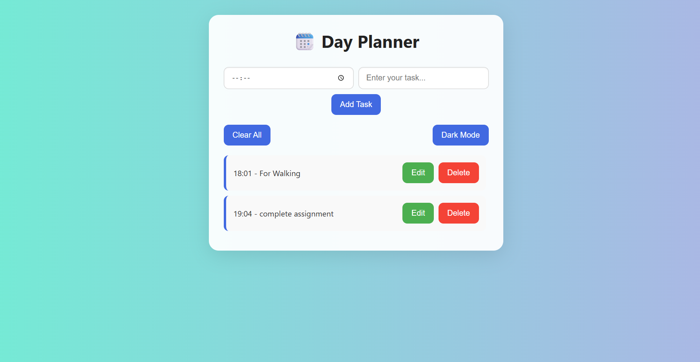
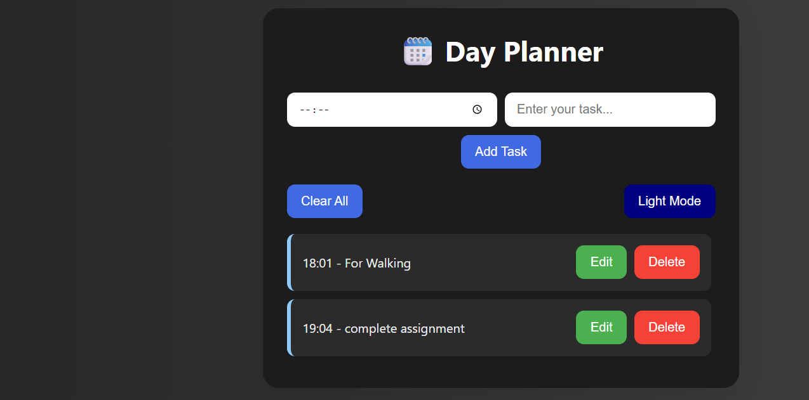

# 🗓️ Day Planner with Reminders and Theme Toggle

A clean, modern day planner web app built with **pure HTML, CSS, and JavaScript** — no libraries, no frameworks. Users can **add tasks**, set **reminder times**, receive **browser alerts**, and switch between **light and dark modes**.

 <!-- Optional: Add screenshot -->


---

## 🚀 Features

- 📌 Add tasks with time & description
- 🔔 Reminder alert at the scheduled time
- 🌙 Toggle between light and dark mode
- 🗑️ Delete individual tasks or clear all
- ✅ Mark tasks as done
- 🎨 Beautiful UI with responsive design

---

## 🛠️ Tech Stack

- **HTML5** – Structure of the app
- **CSS3** – Modern UI design with gradient backgrounds, glassmorphism & responsive layout
- **JavaScript** – Handles reminders, local storage, interactivity

---

## 📦 How to Run Locally

```bash
# Clone the repo
git clone https://github.com/vivekkk-1/Brainwave-Task-1.git

# Navigate to project folder
cd Brainwave-Task-1

# Open in browser
Start index.html in any browser
